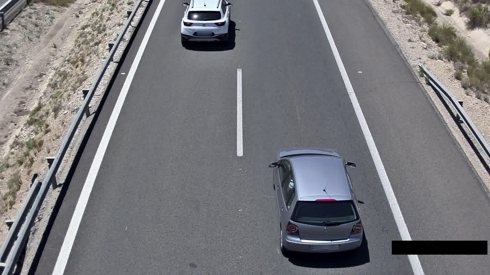
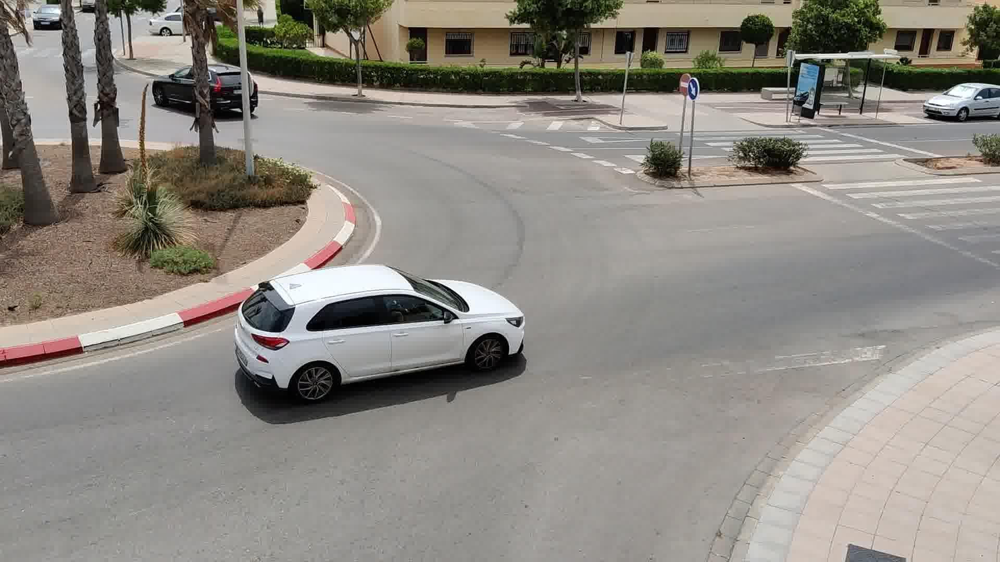
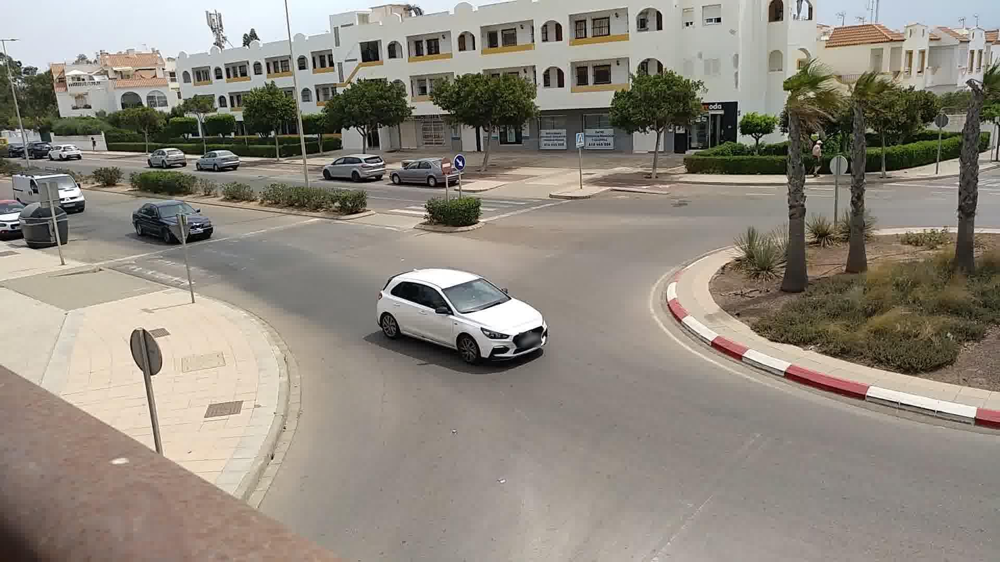

# UC3M-VRI

UC3M-VRI is a dataset for Vehicle Re-Identification based on visual features. It contains 1611 images from 286 different vehicles. Labels include information about make and model of the vehicle. It offers a comprehensive collection of images and labels with make and model information from diverse perspectives and conditions, providing a challenging and realistic environment for VRI research and development. Check the [open-access paper](https://doi.org/10.1016/j.robot.2023.104608).

## Overview

The dataset is divided into two subsets: highway and intersection. 

### Highway subset

Highway subset comprises images captured from a pole on a highway, from an elevated, oblique, and rear angle. This set is characterized by a high degree of similarity between images of the same category, as they exhibit the same perspective, uniform lighting, and no obstructions. It is intended to serve as the first stage in the evaluation process, as it is comparatively less challenging and expected to yield more positive outcomes. The dataset encompasses 458 images from 201 vehicle models.

<p align='center'>
    
</p>

### Intersection subset

The intersection subset includes traffic scenes captured at intersections. It is divided into two distinct recording locations and offers a variety of perspectives and occlusions between vehicles and vegetation. Each scene has been simultaneously captured by two cameras (c1 and c2) and represents a high degree of difficulty as it depicts a typical operational environment. Having two input sources enables searching for annotated vehicles from one camera in the other with a different perspective, which is the primary objective of this study. The dataset includes a total of 1153 images and 85 classes with slightly different annotation criteria.

- c1: 00000 - 00395 are from v1, 00396 - 00530 from v2
- c2: 00000 - 00525 are from v1, 00526 - 00621 from v2

<p align='center'>
    
    
</p>


## Citation

If you use this dataset in your research, please cite the following paper:

```
@article{RamajoBallester2024,
    title = {Dual license plate recognition and visual features encoding for vehicle identification},
    journal = {Robotics and Autonomous Systems},
    volume = {172},
    pages = {104608},
    year = {2024},
    issn = {0921-8890},
    doi = {https://doi.org/10.1016/j.robot.2023.104608},
    url = {https://www.sciencedirect.com/science/article/pii/S0921889023002476},
    author = {Álvaro Ramajo-Ballester and José María {Armingol Moreno} and Arturo {de la Escalera Hueso}},
    keywords = {Deep learning, Public dataset, ALPR, License plate recognition, Vehicle re-identification, Object detection},
}
```

## Download

The dataset is available for [download](https://doi.org/10.21950/MKWOEQ).